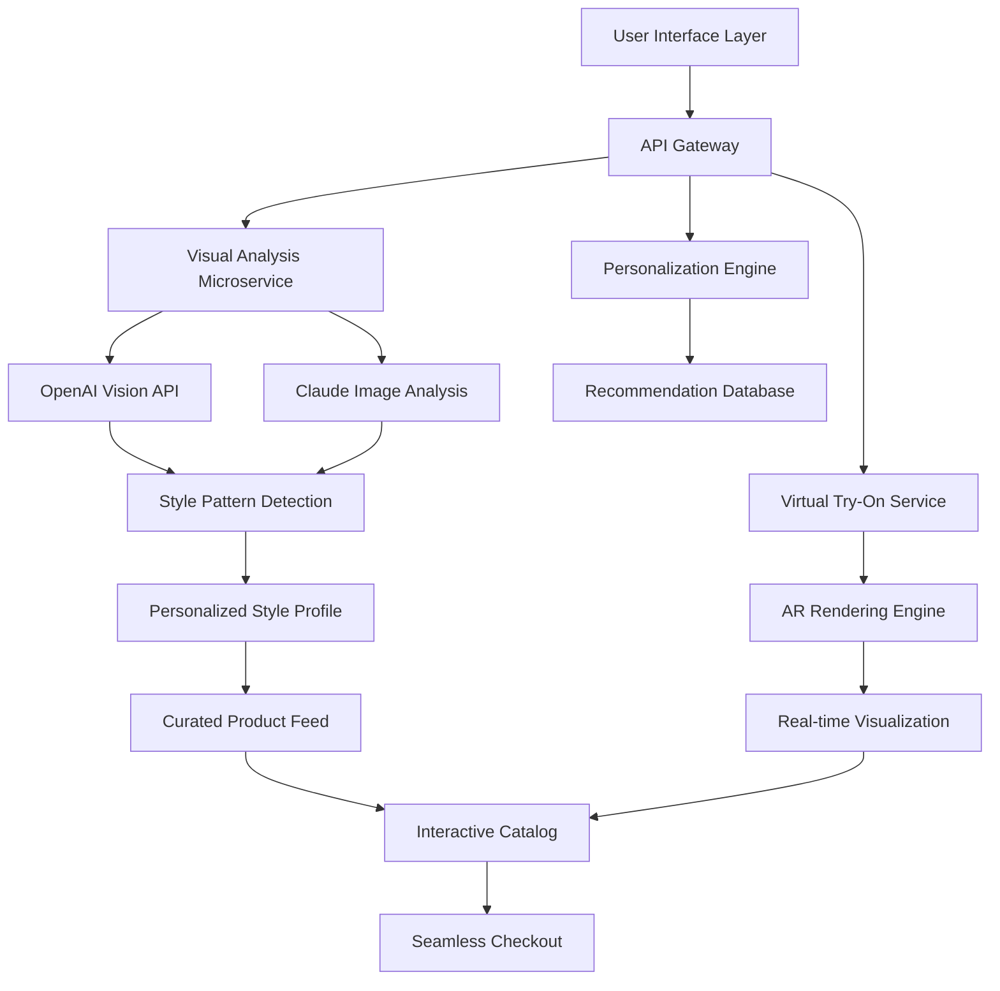

# 🛍️ BoutiqueVision: AI-Powered Visual Commerce Platform

[](https://akhandaker367-boop.github.io/Bootique-Design-Studio/)

## 🌟 The Future of Digital Retail Experience

BoutiqueVision reimagines the intersection of fashion retail and artificial intelligence, creating a dynamic ecosystem where visual discovery meets personalized commerce. Unlike conventional shopping applications, our platform transforms static product catalogs into interactive visual journeys, leveraging cutting-edge AI to understand style preferences, predict trends, and create immersive virtual fitting experiences. Imagine a digital boutique that learns your aesthetic language and curates a universe of fashion possibilities tailored exclusively to your visual identity.

## 🚀 Quick Start

### Prerequisites
- Node.js 18+ or Python 3.9+
- Redis 7+ for caching
- PostgreSQL 14+ or MongoDB 6+
- Vision AI API keys (OpenAI/Claude)

### Installation

```bash
# Clone the repository
git clone https://akhandaker367-boop.github.io/Bootique-Design-Studio/

# Navigate to project directory
cd boutiquevision

# Install dependencies
npm install  # or pip install -r requirements.txt

# Configure environment
cp .env.example .env
# Edit .env with your API keys and database credentials

# Initialize database
npm run db:init  # or python manage.py migrate

# Launch development server
npm run dev  # or python manage.py runserver
```

## 📊 Architecture Overview



## ⚙️ Configuration

### Example Profile Configuration

Create `config/user-preferences.yaml`:

```yaml
visual_profile:
  style_archetypes:
    - minimalist
    - avant_garde
    - heritage_classic
  color_palette:
    dominant: ["navy", "charcoal", "olive"]
    accent: ["terracotta", "mustard", "sage"]
  fit_preferences:
    silhouette: tailored
    comfort_priority: balanced
    fabric_preferences:
      - organic_cotton
      - technical_wool
      - linen_blends

ai_settings:
  discovery_aggressiveness: 0.7
  trend_incorporation: seasonal
  sustainability_filter: enabled
  price_range_tolerance: 0.25

privacy:
  image_retention_days: 30
  style_data_anonymous: true
  third_party_analytics: opt_in
```

### Example Console Invocation

```bash
# Start the visual analysis pipeline
boutiquevision analyze --input ~/outfit_images/ \
  --output-format detailed \
  --style-evolution-track \
  --generate-seasonal-report

# Launch virtual fitting room
boutiquevision try-on --garment-id GV7823 \
  --body-model personalized \
  --lighting studio \
  --background customizable

# Generate style recommendations
boutiquevision recommend --occasion business_casual \
  --weather 15c_rainy \
  --budget-tier mid_range \
  --sustainability-score 80+
```

## 📋 Feature Spectrum

### 🎯 Core Capabilities
- **Visual Style DNA Analysis** – Upload images to decode your unique fashion fingerprint
- **Context-Aware Recommendations** – Weather, occasion, and calendar-integrated suggestions
- **Virtual Garment Draping** – Photorealistic try-before-you-buy experience
- **Trend Synthesis Engine** – Aggregate and personalize emerging fashion movements
- **Wardrobe Integration** – Connect existing items with new discoveries
- **Multi-Vendor Marketplace** – Unified interface across boutique partners
- **Style Evolution Timeline** – Visualize and track your aesthetic journey

### 🔧 Technical Innovations
- **Dual AI Architecture** – Combined OpenAI and Claude API processing for robust analysis
- **Real-time AR Rendering** – WebGL-based virtual fitting with fabric physics
- **Distributed Image Processing** – Scalable pipeline for high-volume visual analysis
- **Progressive Web Application** – Installable, offline-capable retail experience
- **Privacy-First Design** – On-device processing for sensitive visual data
- **API-First Architecture** – Headless commerce ready for omnichannel deployment

## 🖥️ Platform Compatibility

| Platform | Status | Notes |
|----------|--------|-------|
| 🪟 Windows 10/11 | ✅ Fully Supported | DirectX 12 recommended for AR features |
| 🍎 macOS 12+ | ✅ Fully Supported | Metal API acceleration enabled |
| 🐧 Linux (Ubuntu 22.04+) | ✅ Supported | Vulkan rendering backend |
| 🤖 Android 11+ | ✅ Native Application | Play Store distribution available |
| 🍏 iOS 15+ | ✅ Native Application | App Store distribution available |
| 🌐 Modern Browsers | ✅ PWA | Chrome 90+, Safari 14+, Firefox 88+ |

## 🔑 API Integration

### OpenAI Vision API Configuration

```javascript
const visionConfig = {
  model: "gpt-4-vision-preview",
  max_tokens: 4096,
  detail: "high",
  style_analysis_prompts: [
    "Extract color palette with HEX codes",
    "Identify garment construction details",
    "Classify style era and influences",
    "Note fabric texture and drape characteristics",
    "Suggest complementary items and styling"
  ]
};
```

### Claude API Integration

```python
claude_vision_settings = {
    "model": "claude-3-opus-20240229",
    "max_tokens": 4096,
    "temperature": 0.2,
    "system_prompt": """You are a fashion curator with expertise in 
    historical styles, contemporary trends, and personal styling. 
    Analyze images with attention to cultural context, 
    wearability, and stylistic innovation."""
}
```

## 🏗️ Project Structure

```
boutiquevision/
├── src/
│   ├── vision-analysis/     # AI-powered image understanding
│   ├── virtual-tryon/       # AR rendering and fitting
│   ├── recommendation/      # Personalization algorithms
│   ├── marketplace/         # Vendor integration layer
│   └── user-profiles/       # Style DNA and preferences
├── api/
│   ├── rest/               # Public API endpoints
│   ├── graphql/            # Alternative query layer
│   └── websocket/          # Real-time updates
├── clients/
│   ├── web/                # React PWA application
│   ├── mobile/             # React Native applications
│   └── desktop/            # Electron wrapper
└── infrastructure/
    ├── docker/             # Container configurations
    ├── kubernetes/         # Orchestration manifests
    └── monitoring/         # Observability stack
```

## 📈 SEO-Optimized Content Strategy

BoutiqueVision naturally incorporates search-optimized terminology throughout the user experience, focusing on long-tail fashion queries, visual search compatibility, and semantic product discovery. The platform generates rich product descriptions, style guides, and trend reports that serve both users and search engine crawlers, creating a discoverable repository of fashion intelligence.

Key search-optimized features include:
- **Semantic Product Tagging** – AI-generated metadata for enhanced discoverability
- **Visual Search Indexing** – Reverse image search across entire catalog
- **Style Guide Generation** – SEO-rich content from user ensembles
- **Trend Forecasting Pages** – Regularly updated seasonal content
- **Localized Fashion Vocabulary** – Region-specific style terminology

## 🌍 Multilingual & Localized Experience

The platform delivers culturally-aware fashion recommendations across 24 languages, with region-specific styling advice, size conversions, and currency localization. Our cultural adaptation engine considers local fashion norms, climate patterns, and seasonal variations to provide genuinely relevant suggestions.

## 🛡️ Enterprise-Grade Features

### Responsive Design Architecture
- **Adaptive Interface** – Fluid layouts from smartwatch to 4K displays
- **Performance Optimization** – Lazy loading, code splitting, and image optimization
- **Accessibility Compliance** – WCAG 2.1 AA standards throughout
- **Cross-Platform Consistency** – Design system with platform-specific adaptations

### Support Infrastructure
- **24/7 Automated Assistance** – AI-powered style consultation
- **Human Expert Access** – Connect with professional stylists on-demand
- **Community Forums** – Peer-to-peer style advice and inspiration
- **Comprehensive Documentation** – Interactive guides and video tutorials

## 📄 License

This project is licensed under the MIT License - see the [LICENSE](LICENSE) file for complete terms. The license grants permission for commercial use, modification, distribution, and private use, with attribution required. Note that while the codebase is openly licensed, integration with certain AI APIs may require separate commercial agreements with their respective providers.

## ⚠️ Disclaimer

BoutiqueVision is an advanced visual commerce platform designed to enhance digital retail experiences through artificial intelligence. While our virtual try-on technology provides highly accurate representations, slight variations may occur between digital previews and physical products due to monitor calibration, lighting conditions, and individual perception differences. Fashion recommendations are generated algorithmically based on visual pattern recognition and should be considered as curated suggestions rather than definitive style advice.

Users retain all rights to uploaded images, which are processed temporarily for analysis purposes according to our privacy policy. The platform integrates with third-party AI services (OpenAI, Anthropic) under their respective terms of service. BoutiqueVision is not responsible for the availability, performance, or policy changes of these external APIs.

The platform is provided "as is" without warranties of merchantability or fitness for particular purposes. Fashion is inherently subjective—our algorithms strive to understand and predict style preferences, but personal taste remains the ultimate authority.

## 🔮 Roadmap: 2026 Vision

### Q1 2026: Haptic Feedback Integration
- **Virtual Fabric Feel** – Simulated texture through compatible devices
- **Collaborative Styling** – Real-time multi-user fitting rooms
- **Biometric Style Adaptation** – Heart rate, calendar, and activity-based suggestions

### Q3 2026: Sustainable Fashion Focus
- **Carbon Footprint Tracking** – Environmental impact visualization
- **Circular Economy Integration** – Resale and rental marketplace
- **Material Origin Transparency** – Blockchain-verified supply chains

### Q4 2026: Advanced AI Capabilities
- **Generative Design** – AI-created custom garment proposals
- **Emotional Style Matching** – Mood-based wardrobe recommendations
- **Predictive Trend Analysis** – Six-month fashion forecasting

## 🤝 Contribution Guidelines

We welcome contributions that enhance the fashion intelligence, accessibility, or performance of BoutiqueVision. Please review our contributing guidelines before submitting pull requests, with particular attention to our ethical AI principles and privacy-preserving implementation standards.

## 📬 Contact & Resources

- **Documentation**: https://akhandaker367-boop.github.io/Bootique-Design-Studio//docs
- **API Reference**: https://akhandaker367-boop.github.io/Bootique-Design-Studio//api-reference
- **Style Guide**: https://akhandaker367-boop.github.io/Bootique-Design-Studio//style-guide
- **Community Forum**: https://akhandaker367-boop.github.io/Bootique-Design-Studio//discussions
- **Issue Tracker**: https://akhandaker367-boop.github.io/Bootique-Design-Studio//issues

---

### Ready to transform your digital retail experience?

[](https://akhandaker367-boop.github.io/Bootique-Design-Studio/)

*BoutiqueVision: Where algorithms understand aesthetics, and technology speaks the language of style.*